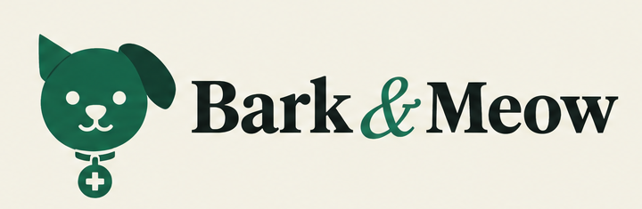
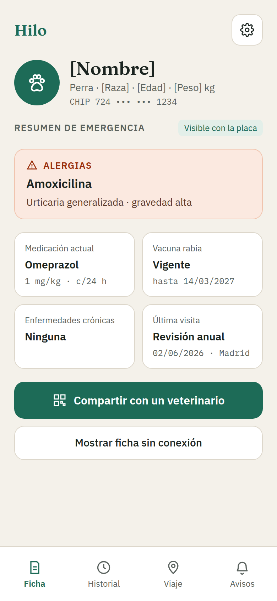
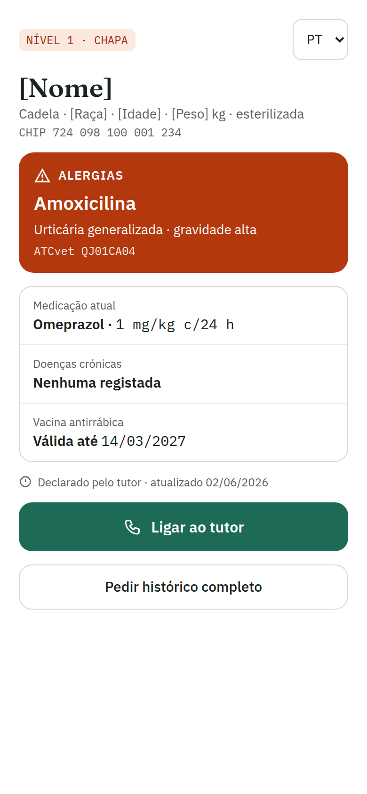
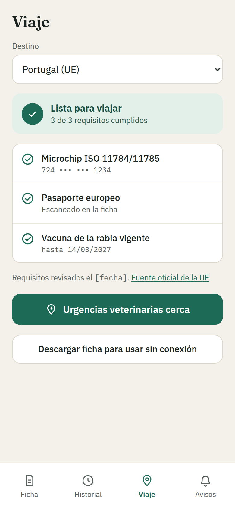

<p align="center">
  <picture>
    <source media="(prefers-color-scheme: dark)" srcset="logos/logo_horizontal_oscuro.png">
    
  </picture>
</p>

<p align="center">
  <strong>Ficha de salud portátil para mascotas, cifrada con la clave del dueño.</strong><br>
  Cualquier veterinario, en cualquier país, la abre en segundos y sin instalar nada.
</p>

---

Hoy hay dos piezas y ninguna resuelve el problema. Los registros de identificación dicen quién es el dueño de un animal, pero no si es alérgico. El historial de su clínica habitual está completo, pero encerrado en el software de esa clínica; la copia en PDF se pierde, se desactualiza y está en un solo idioma.

Bark & Meow es la ficha que viaja con la mascota. **El servidor guarda bloques que no puede abrir:** el acceso lo da un objeto físico (la placa del collar) o un permiso explícito del dueño, nunca el hecho de tener una cuenta.

> **Estado: en desarrollo.** No hay clínicas piloto, usuarios reales ni métricas. Las capturas y la demo usan datos de ejemplo. Bark & Meow es información aportada por el dueño, no un registro oficial.

## Cómo se accede a una ficha

| Nivel | Cómo se obtiene | Qué da |
| --- | --- | --- |
| **0 · Localizar** | Número de microchip | Si existe ficha, el perfil público que el dueño haya publicado y un aviso sellado para él |
| **1 · Emergencia** | Placa del collar (QR o NFC); la clave va en el fragmento `#` de la URL | Alergias, enfermedades crónicas, medicación, rabia y contacto |
| **2 · Historial** | Enlace temporal del dueño (24 h, 72 h o 7 días), revocable | El historial completo, y dejar una nota de la visita |
| **3 · Veterinario habitual** | El dueño aprueba a la clínica comparando un número de seis dígitos | Acceso permanente y revocable, y envío de informes firmados |

El número de chip **localiza, nunca abre**: lo lee cualquier lector y sale en pasaportes y facturas. Por eso un registro solo responde cuando una clínica lo activa con el animal delante y el código del dueño.

<p align="center">
  
  
  
</p>
<p align="center"><sub>Pantallas del lienzo de diseño, con datos de ejemplo. Las siete están en <a href="pantallas/"><code>pantallas/</code></a>.</sub></p>

## Qué protege los datos

- **Cifrado en el cliente.** Núcleo en Rust compilado a WASM ([`packages/crypto`](packages/crypto)): XChaCha20-Poly1305 para la ficha, X25519 para sellar y Ed25519 para firmar. La app móvil lo replica byte a byte en JavaScript y un test lo compara contra el `.wasm`.
- **El servidor no puede descifrar.** `apps/api` no depende de `packages/crypto` a propósito: si alguien añade descifrado en el servidor, el grafo de dependencias lo delata en la revisión.
- **El chip no se guarda.** Solo `HMAC-SHA256(pepper, chip)`, con el pepper en un proceso aislado ([`services/pepper`](services/pepper)).
- **Sin enumeración.** La consulta por chip responde con el mismo tamaño (4096 bytes) y el mismo tiempo exista o no la ficha, con señuelos de la forma correcta.
- **Número de comparación.** Al pedir el nivel 3, clínica y dueño ven un número derivado de sus dos claves públicas; un intermediario produce otro distinto.
- **Procedencia visible.** Lo que declara el dueño no pesa lo mismo que un informe firmado por una clínica, y la interfaz lo distingue.
- **Recuperación sin puerta trasera.** La clave del dueño sale de un código en papel generado en su navegador; perder la contraseña no la toca.

El diseño completo, con sus porqués, está en [`barkandmeow-arquitectura.md`](barkandmeow-arquitectura.md), que **manda sobre el código**.

## Qué hay en el repositorio

```
apps/
  vet/        Web del veterinario de guardia: sin cuentas, export estático     4510
  clinic/     SaaS de la clínica (/clinica): activar, altas, equipo, conexión  4520
  portal/     Portal del dueño (/mi-mascota): mascotas, bandeja, permisos,
              pasaporte de viaje, cuenta                                       4530
  ops/        Panel del operador (/operador): reclamaciones de chip            4540
  api/        Fastify: índice de chips, permisos, bloques cifrados             4601
  mobile/     App del dueño, React Native con Expo (primero Android)
  conector/   Servicio que corre en la clínica: lee ezyVet, Provet Cloud o
              QVET y envía informes firmados y sellados
packages/
  crypto/     Rust → WASM, con su envoltorio TypeScript
  schema/     Contratos Zod, catálogo de la API, cliente común, especies
  spec/       openapi.yaml generado del catálogo
  db/         Esquema Drizzle y migraciones
  ui-web/     Componentes compartidos por las webs
  tokens/     Fuente única del sistema visual → CSS y TypeScript
  i18n/       Catálogos en es, pt, en y fr
  config/     tsconfig compartido
services/
  pepper/     HMAC del número de chip, aislado en su propio proceso            4600
infra/
  compose.yaml   postgres 5443 · dragonfly 6390 · pepper 4600
```

## Arrancar en local

Hace falta Node 22.9 o superior, pnpm y Docker. Rust solo si vas a tocar `packages/crypto`: el `.wasm` compilado ya está en el repositorio.

```bash
pnpm install
docker compose -f infra/compose.yaml up -d postgres dragonfly
pnpm --filter @barkandmeow/db db:migrate
pnpm dev
```

Las variables de entorno están en [`.env.example`](.env.example), en un bloque por app: copia cada bloque a su archivo (`apps/api/.env`, etc.).

Se entra por **http://localhost:4510**:

| Ruta | Qué es |
| --- | --- |
| `/` | Presentación |
| `/chip` | Consulta por microchip del veterinario (nivel 0) |
| `/clinica` | SaaS de la clínica |
| `/mi-mascota` | Portal del dueño |

En desarrollo, `apps/vet` reenvía `/clinica` y `/mi-mascota` a sus apps; en producción el proxy ([`infra/Caddyfile`](infra/Caddyfile)) hace el mismo reparto. El panel del operador va aparte, en `http://localhost:4540/operador`. Para que la consulta de chip responda, la API necesita `PEPPER_URL` o `CHIP_PEPPER_LOCAL`.

Para tener una clínica, una dueña y dos mascotas de prueba:

```bash
pnpm --filter @barkandmeow/api demo
```

## La API

El contrato vive en un solo sitio: el catálogo Zod de [`packages/schema/src/api`](packages/schema/src/api). De él salen el cliente que usan todas las apps, la validación de las respuestas en los tests y el documento OpenAPI.

- **Swagger UI** en `http://127.0.0.1:4601/docs` (apagado en producción).
- **OpenAPI** en [`packages/spec/openapi.yaml`](packages/spec/openapi.yaml); se regenera con `pnpm spec`.
- Una ruta que no esté en el catálogo, o un `openapi.yaml` sin regenerar, hacen fallar los tests.

## Comandos

| Comando | Qué hace |
| --- | --- |
| `pnpm dev` | Levanta todas las apps |
| `pnpm test` | Tests de la API contra PostgreSQL (en una base `_test` aparte), del núcleo criptográfico, de la app y del conector |
| `pnpm typecheck` · `pnpm lint` | `tsc --noEmit` y ESLint en todo el workspace |
| `pnpm spec` | Regenera `openapi.yaml` desde el catálogo |
| `pnpm tokens` | Regenera el sistema visual desde `diseno/tokens.json` |
| `pnpm docs:build` | Regenera el `.docx` y el `.pdf` del documento de arquitectura |

**El sistema visual no se edita en CSS.** Se edita [`diseno/tokens.json`](diseno/tokens.json) y se corre `pnpm tokens`.

## Estado

| Hecho | Pendiente |
| --- | --- |
| Consulta por chip sin enumeración, perfil público y aviso al dueño | Federación con otros registros y plataformas |
| Placa de emergencia y enlace temporal de historial en la web del veterinario | Escritura NFC de la placa desde la app |
| Registro, activación en clínica y reclamación de un chip | Ficha, importación de informes y modo sin conexión en la app |
| Alta de nivel 3 con número de comparación, en clínica, portal y app | Prueba de la app en dispositivos reales |
| Informes firmados y sellados desde el software de gestión, con PDF adjuntos | Prueba del conector contra cuentas reales de ezyVet, Provet y QVET |
| Pasaporte de viaje con requisitos por destino y recordatorios `.ics` | Modelo de negocio: sin decidir, no hay planes ni precios |
| Segundo factor por correo o SMS, avisos push sin contenido | |
| Recuperación de cuenta con el código en papel | |

## Documentos

- [`barkandmeow-arquitectura.md`](barkandmeow-arquitectura.md): arquitectura, criptografía, federación y roadmap. También en [`.docx`](barkandmeow-arquitectura.docx) y [`.pdf`](barkandmeow-arquitectura.pdf).
- [`PRODUCT.md`](PRODUCT.md): para quién es, principios y decisiones abiertas.
- [`DESIGN.md`](DESIGN.md): sistema visual.
- [`apps/conector/README.md`](apps/conector/README.md): cómo conectar el software de una clínica.

## Seguridad

Si encuentras un fallo de seguridad, no abras una incidencia pública: usa [el aviso privado de GitHub](https://github.com/RedderLabs/barkandmeow/security/advisories/new).

## Licencia

Código bajo [AGPL-3.0](LICENSE). La especificación de federación y el esquema clínico, bajo CC BY 4.0. Tipografías Fraunces, IBM Plex Sans e IBM Plex Mono, bajo SIL OFL.
