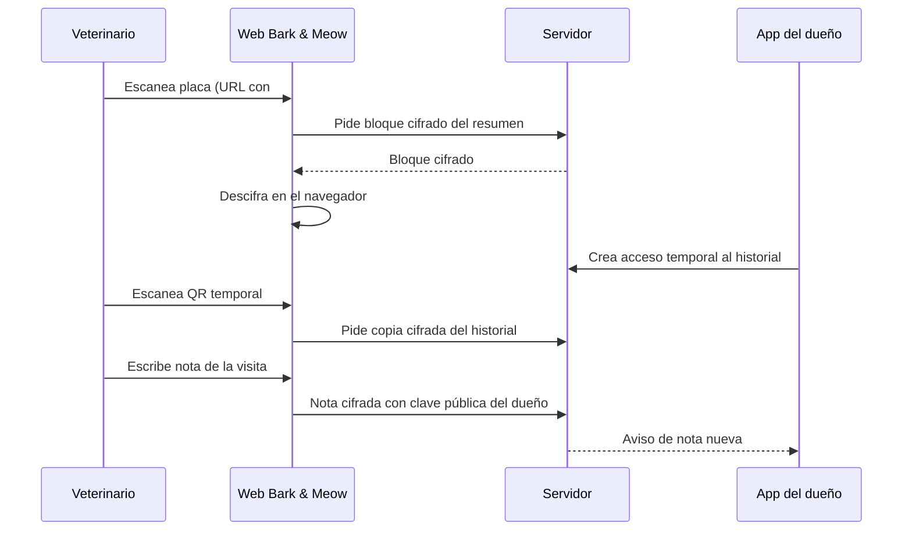
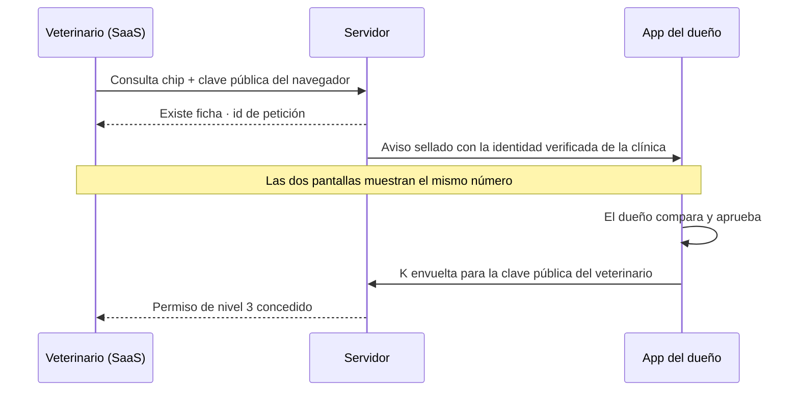
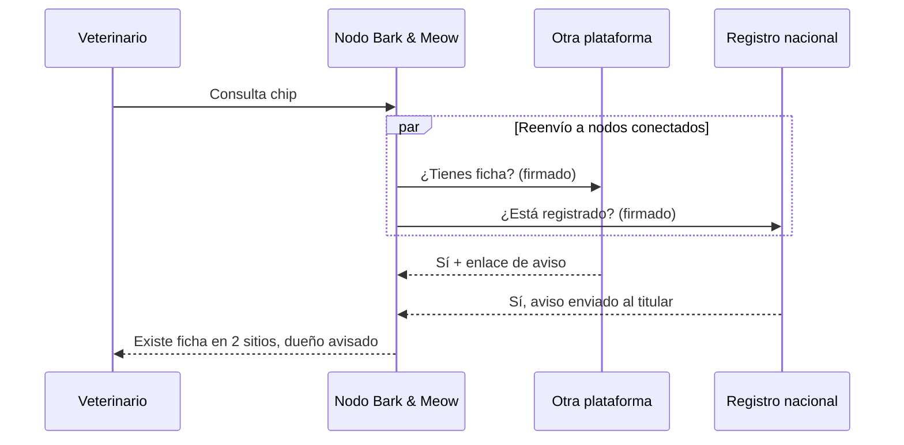

# Bark & Meow — Ficha de salud portátil para mascotas

26 de septiembre de 2026 · 0xSignalShadow

## Objetivo y principios

**Bark & Meow** (nombre de trabajo) permite que cualquier veterinario, en cualquier país, vea la ficha de salud actualizada de una mascota en segundos, sin instalar nada y sin que el dueño pierda el control de los datos.

Hoy existen dos piezas y ninguna resuelve el problema:

- **Registros de identificación** (RIAC en Madrid, REIAC en España, Europetnet en Europa): dicen quién es el dueño, no si el animal es alérgico o qué medicación toma.
- **Historial en la clínica habitual**: completo, pero encerrado en el software de esa clínica. La copia en PDF se pierde, queda desactualizada tras cada visita y está en un solo idioma.

Principios de diseño:

1. **El dueño es el custodio.** Los datos viven cifrados; el servidor no puede leerlos.
2. **Cero fricción para el veterinario.** Una web que se abre desde un QR, NFC o número de chip. Sin cuentas ni instalación.
3. **El número de chip es público.** Sirve para localizar la ficha, nunca para abrirla.
4. **Estructurado antes que texto libre.** Para poder traducir y comparar entre países.
5. **La ficha se actualiza sola en cada visita.** El veterinario que atiende puede añadir notas, que vuelven cifradas al dueño.
6. **Distinguir siempre el origen del dato.** Lo que declara el dueño no pesa igual que un informe firmado por una clínica.

## Actores y flujos principales

| Actor | Qué necesita | Cómo accede |
| --- | --- | --- |
| Dueño | Mantener la ficha y decidir quién la ve | App móvil (React Native) |
| Veterinario de guardia (otra ciudad o país) | Alergias, medicación, antecedentes, ya | Web: QR, NFC o número de chip |
| Veterinario habitual | Ver lo que pasó fuera y subir informes | SaaS de la clínica, con acceso permanente que concede el dueño |
| Quien encuentra al animal perdido | Contactar con el dueño | QR o NFC de la placa |

**Flujo 1 — Urgencia en el extranjero, dueño presente**

1. El veterinario escanea la placa o el dueño le enseña un QR en su móvil.
2. Se abre la web en el idioma del navegador del veterinario con el resumen de emergencia.
3. El dueño pulsa "Compartir historial completo" y elige 24 o 72 horas; el veterinario escanea el nuevo QR.
4. Al terminar, el veterinario añade la nota de la visita, diagnóstico y tratamiento.
5. La nota llega cifrada a la app del dueño, que la acepta en la ficha.

**Flujo 2 — Dueño ausente o sin móvil**

1. El veterinario lee el chip con su lector e introduce el número en la web, o escanea la placa.
2. Con solo el número de chip ve "Existe ficha" y un botón para avisar al dueño dejando su clínica y teléfono.
3. Con la placa física ve el resumen de emergencia directamente.

**Flujo 3 — Vuelta a casa**

El veterinario habitual, con un acceso permanente concedido por el dueño, ve la nota del veterinario extranjero y la traducción de los campos estructurados, y puede subir sus propios informes.



## Niveles de acceso y vías físicas

| Nivel | Qué hace falta | Qué se ve | Caduca |
| --- | --- | --- | --- |
| 0 — Localizar | Número de chip | "Existe ficha", el perfil público si el dueño lo publicó (foto, bio, teléfonos) + botón para avisar al dueño | — |
| 1 — Emergencia | Placa QR/NFC (clave en la URL) | Alergias, enfermedades crónicas, medicación actual, vacuna de la rabia, contacto | No; se rota al cambiar la placa |
| 2 — Historial | Enlace temporal generado por el dueño | Todo: visitas, analíticas, documentos originales | 24 h, 72 h o 7 días; revocable |
| 3 — Veterinario habitual | Acceso permanente concedido por el dueño, pedido desde el SaaS de la clínica y aprobado con número de comparación | Todo + subir informes | Hasta que el dueño lo retire |

El dueño elige qué campos entran en el nivel 1. Por defecto: alergias, enfermedades crónicas, medicación actual y teléfono de contacto.

**Vías físicas**

- **Microchip subcutáneo** (ISO 11784/11785, 134,2 kHz). Lo leen veterinarios y protectoras con su lector; los móviles no pueden, porque su NFC trabaja a 13,56 MHz. Solo da acceso al nivel 0.
- **Placa del collar con QR impreso y chip NFC de 13,56 MHz.** Cualquier móvil la lee. Contiene la misma URL: `https://[dominio]/e/{id}#{clave}`. Da acceso al nivel 1.
- **QR en la app del dueño.** Para el nivel 2; se genera en el momento y solo vale para esa consulta.

Lectores Bluetooth de 134,2 kHz: la web y la app aceptan el número en un campo de texto, porque la mayoría de estos lectores funcionan como teclado Bluetooth.

## Alta del veterinario habitual desde el SaaS

Hasta ahora el nivel 3 decía «acceso permanente concedido por el dueño» sin explicar cómo se pide. Y el nivel 0 solo permitía avisar al dueño dejando un nombre de clínica y un teléfono que él no puede comprobar. Esta sección cierra las dos cosas: con la clínica autenticada en el SaaS, el chip sirve para **pedir** el alta, y el dueño la aprueba comparando un número.

**Cuándo se usa y cuándo no.** Esta vía **no** es un camino de urgencia. Una urgencia se resuelve con la placa (nivel 1), que no depende de que nadie conteste, o con el QR del dueño presente (nivel 2). El alta desde el SaaS es deliberada y permanente: da de alta a la clínica como veterinario habitual de ese animal. Si en una urgencia el dueño no responde, el veterinario tiene la placa; nunca se espera a una aprobación para atender.

**Flujo 4 — Alta del veterinario habitual**

1. El veterinario, ya autenticado en el SaaS, lee el chip con su lector e introduce el número (o escanea la placa).
2. El servidor responde como en el nivel 0: existe o no existe, con el mismo tamaño y el mismo tiempo en ambos casos. El alta no debilita la protección contra recorrer números.
3. El veterinario pide el alta. Su navegador genera un par X25519 si no lo tiene y envía la clave pública con la petición.
4. El servidor sella el aviso contra la clave pública del dueño y lo envía por push. El aviso lleva la **identidad verificada de la clínica** —nombre, ciudad, país y dominio comprobado—, no un teléfono tecleado a mano.
5. Las dos pantallas muestran el **mismo número de comparación**, derivado de las dos claves públicas y del identificador de la petición.
6. El dueño comprueba que el número de su app coincide con el que le dicta el veterinario y aprueba. Su app envuelve la clave de la ficha `K` para la clave pública del veterinario y sube el permiso de nivel 3.
7. El veterinario ya abre la ficha en su navegador. El servidor nunca vio `K` ni el número de chip en claro.



**El número de comparación**

- Derivación: `BLAKE2b(pk_veterinario ‖ pk_dueño ‖ id_petición)` truncado a 20 bits, presentado como **seis dígitos decimales**.
- **No es un secreto y no abre nada.** Se puede decir en voz alta por teléfono. Fuera de esa petición concreta no vale para nada, así que interceptarlo no sirve de nada.
- Su función es detectar al intermediario. Quien se cuele en medio y ponga su propia clave pública produce un número distinto en una de las dos pantallas, y la comparación falla.
- Caduca con la petición.

**La comparación tiene que costar algo.** Un único botón «Aprobar» enseña al dueño a pulsarlo sin mirar, y entonces el número no protege de nada. En la app, el número va grande y en monoespaciada, y las dos salidas pesan lo mismo: «Coinciden, dar acceso» y «No coinciden, rechazar y avisar». La segunda no es un enlace pequeño.

**Si el dueño no contesta**

- La petición caduca a los **10 minutos**, porque el número está en pantalla mientras tanto.
- El aviso se queda en la app como pendiente. El dueño puede atenderlo más tarde, y entonces se abre una petición nueva con su propio número: un número caducado no revive.
- El veterinario ve «sin respuesta» y, al lado, la alternativa real: la placa del collar da el nivel 1 en el momento.

**Límites y abuso**

- Límite de peticiones por cuenta de clínica, además del límite por IP que ya protege el nivel 0.
- Una clínica que dispara peticiones contra muchos chips distintos sin que casi ninguna se apruebe es el patrón de quien está recorriendo números: se marca y se suspende.
- Cada petición, aprobada o no, queda en el registro de accesos del dueño con la identidad de la clínica.

**Revocación.** El dueño retira el nivel 3 cuando quiera y el permiso se borra. Lo que el veterinario ya descargó no vuelve, y la app lo dice al aprobar, igual que en el nivel 2.

**Endpoints**

| Endpoint | Quién lo llama | Función |
| --- | --- | --- |
| `POST /grants/v1/request` | SaaS de la clínica | Pide alta de nivel 3 para un chip; devuelve id de petición y número de comparación |
| `GET /grants/v1/request/{id}` | SaaS de la clínica | Estado: pendiente, aprobada, rechazada o caducada |
| `POST /grants/v1/approve` | App del dueño | Sube `K` envuelta para la clave pública del veterinario |
| `POST /grants/v1/revoke` | App del dueño | Retira el nivel 3 |

```ts
export const grantRequests = pgTable('grant_requests', {
  id: uuid('id').defaultRandom().primaryKey(),
  petId: uuid('pet_id').references(() => pets.id),
  clinicId: uuid('clinic_id').references(() => clinics.id),
  vetPubKey: bytea('vet_pub_key').notNull(),   // clave del navegador del veterinario
  state: text('state').$type<'pending' | 'approved' | 'rejected' | 'expired'>(),
  createdAt: timestamp('created_at').defaultNow(),
  expiresAt: timestamp('expires_at').notNull(), // 10 minutos
});
```

El número de comparación no se guarda: las dos partes lo derivan de datos que ya tienen.

## La clínica como organización: alta, equipo y claves

**Alta de la clínica.** Se registra con nombre, dirección, país y número de registro sanitario; el dominio no se pregunta. (Decidido el 27/09/2026.) El administrador recibe un código de 8 caracteres en su correo, que caduca a los 15 minutos y admite 5 intentos: hasta confirmarlo la clínica no puede invitar al equipo, preparar fichas ni pedir accesos. Si el correo es del dominio de la clínica (nombre@clinica.es), confirmarlo **verifica también el dominio**, porque solo alguien de esa organización recibe correo ahí, y el aviso que recibe el dueño dice «clínica verificada · clinica.es». Con un correo gratuito (Gmail, Hotmail…) el correo queda confirmado pero la clínica **no aparece como verificada**, y ese sello es justo lo que hace creíble una petición de nivel 3.

**Tres roles.**

| Rol | Qué puede hacer |
| --- | --- |
| Administrador | Gestiona el equipo y la conexión, y **custodia la clave de la clínica**. Todo lo del veterinario |
| Veterinario | Busca, carga datos, pide altas de nivel 3 y **firma informes** |
| Auxiliar | Busca y carga datos. No firma |

La firma distingue lo que un veterinario diagnostica de lo que un auxiliar transcribe, y esa diferencia viaja con el dato: la procedencia que ve el veterinario extranjero dice cuál de las dos cosas es.

**Las claves, en dos niveles.** El dueño aprueba **a la clínica**, una sola vez, y envuelve `K` para la clave pública de la clínica. Esa clave privada vive en el navegador del administrador. Es el administrador quien envuelve `K` para la clave de cada trabajador activo.

- Dar de alta a un trabajador no molesta al dueño: no hace falta que apruebe nada de nuevo.
- Darlo de baja borra su envoltura. Conserva lo que ya descargó —la misma limitación que el doc reconoce en el nivel 2— pero no puede pedir nada más.
- La clave de la clínica **no rota** al dar de baja a alguien, porque rotarla obligaría a cientos de dueños a volver a aprobar. Solo se rota si se compromete la cuenta de un administrador, y entonces sí hay que repetir las aprobaciones.
- Ningún trabajador que no sea administrador llega a tener la clave de la clínica.

**Recuperación.** Si se pierde la clave de la clínica se pierden todos los permisos de nivel 3 concedidos. Por eso el alta exige **dos administradores o un código de recuperación en papel**, igual que las 24 palabras del dueño. La consola avisa mientras haya un solo administrador y ningún código generado.

**Fichas preparadas sin dueño (borradores).** Una clínica puede cargar los datos de una mascota cuyo dueño todavía no usa Bark & Meow. No hay clave pública a la que cifrar, así que el borrador se guarda cifrado **con la clave de la clínica** y se re-cifra para el dueño cuando este instala la app y reclama la mascota.

- El servidor sigue sin poder leer nada.
- No expone datos nuevos: esos datos ya estaban en el software de la clínica. Lo que sí crea es una ficha que el dueño todavía no controla, y eso obliga a dos límites.
- **Caducan a los 90 días.** Pasado el plazo se borran, salvo que la clínica los renueve.
- **Son visibles y contables.** La consola enseña cuántos borradores sin dueño hay y cuál caduca antes. Un borrador no es una ficha: no responde a búsquedas de nivel 0 hasta que el dueño lo reclama.
- Al reclamar, el dueño ve de dónde viene cada dato y puede rechazarlo. Un borrador es una propuesta, no un hecho consumado.

```ts
export const clinics = pgTable('clinics', {
  id: uuid('id').defaultRandom().primaryKey(),
  name: text('name').notNull(),
  country: text('country').notNull(),
  domain: text('domain').unique(),
  domainVerifiedAt: timestamp('domain_verified_at'),
  pubKey: bytea('pub_key').notNull(),          // clave pública de la clínica
});

export const clinicMembers = pgTable('clinic_members', {
  id: uuid('id').defaultRandom().primaryKey(),
  clinicId: uuid('clinic_id').references(() => clinics.id),
  role: text('role').$type<'admin' | 'vet' | 'assistant'>().notNull(),
  devicePubKey: bytea('device_pub_key').notNull(),
  wrappedClinicKey: bytea('wrapped_clinic_key'), // solo para administradores
  revokedAt: timestamp('revoked_at'),
});

export const drafts = pgTable('drafts', {
  id: uuid('id').defaultRandom().primaryKey(),
  clinicId: uuid('clinic_id').references(() => clinics.id),
  sealed: bytea('sealed').notNull(),           // cifrado a la clave de la clínica
  claimedByPetId: uuid('claimed_by_pet_id').references(() => pets.id),
  expiresAt: timestamp('expires_at').notNull(), // 90 días
});
```

**Software de gestión conectado por API** (decidido el 29/09/2026). El software de gestión de la clínica envía los informes de la consulta a la bandeja del dueño sin que nadie los copie a mano.

- Un administrador crea una **clave de API** en la consola (pantalla Conexión). El token (`bmk_…`) se enseña una sola vez; el servidor guarda su hash. Hasta 10 claves vivas por clínica; retirar una la invalida al momento.
- La clave **no abre ninguna ficha**. Solo sirve para enviar, y solo a mascotas activas cuyo dueño dio a esa clínica un nivel 3 que sigue vivo. Fuera de ellas la API responde 404 sin decir si el chip existe, así que tampoco sirve para recorrer números.
- El software **sella el informe en su propio servidor** con `crypto_box_seal` de libsodium para la clave pública del dueño, la misma primitiva que las notas y los avisos. Bark & Meow lo guarda sin poder leerlo.
- **El remitente lo pone el servidor**, según la clave con que llegó, no el contenido. El portal del dueño enseña «Enviado por Clínica X · dominio verificado · desde su software de gestión». Un sobre con forma de informe que llegue por otra vía (la nota de la web del veterinario) se enseña como nota, sin clínica.
- La consola lleva un **registro de envíos** sin contenido: fecha, últimos dígitos del chip, clave y tamaño. Sobrevive a que el dueño borre el mensaje.
- Límite de 120 peticiones por minuto y clave. Sin clave válida cuenta la IP, así que inventar tokens no abre cupos nuevos.
- **Firma** (hecho el 29/09/2026). Cada conexión tiene además una **clave de firma Ed25519** que nace en el navegador del administrador y se entrega al software una sola vez (`bmf_…`); el servidor solo guarda la pública. El software firma el JSON del registro y lo sella dentro de un sobre `{ tipo: "firmado", registro, firma, clave }`. El dueño comprueba que la firma es de la clave de la conexión que lo envió, y quien reciba el pasaporte en un viaje la comprueba contra el directorio público `GET /firmas/v1/{clave}`. Una clave retirada sigue en el directorio con su fecha: lo firmado antes sigue valiendo.
- **Pendiente:** documentos adjuntos (PDF). El registro es texto, hasta 64 KB sellado.

| Endpoint | Quién lo llama | Función |
| --- | --- | --- |
| `GET /clinics/v1/api/me` | Software de gestión (clave de API) | Comprobar la clave |
| `GET /clinics/v1/api/patients` | Software de gestión | Pacientes con nivel 3 vivo y la clave pública de su dueño |
| `POST /clinics/v1/api/patients/search` | Software de gestión | El paciente de un chip, solo entre los que tienen nivel 3 con la clínica |
| `POST /clinics/v1/reports` | Software de gestión | Enviar un informe sellado: `{ petId, sellado }` |
| `GET/POST/DELETE /clinics/v1/api-keys` | Consola (sesión) | Ver, crear (administrador) y retirar claves |
| `GET /clinics/v1/reports` | Consola (sesión) | Registro de envíos |
| `GET /firmas/v1/{clave}` | Cualquiera (web del veterinario) | De qué clínica es una clave de firma, y si se retiró |
| `GET/PUT /owners/v1/pets/{id}/passport` | Portal del dueño | Pasaporte de viaje cifrado, con versión |
| `GET/POST/DELETE /owners/v1/pets/{id}/shares` | Portal del dueño | Enlaces de viaje temporales |

El informe, antes de sellarlo:

```json
{
  "version": 1,
  "tipo": "informe",
  "fecha": "2026-09-29",
  "veterinario": "Dra. Ruiz",
  "motivo": "Revisión anual",
  "diagnostico": "Sano",
  "tratamiento": "Vacuna de la rabia",
  "observaciones": "Próxima revisión en un año"
}
```

`BM_API_KEY=… BM_FIRMA=… pnpm --filter @barkandmeow/api registro <registro.json>` hace de software de gestión: valida el registro, lo firma, lo sella y lo envía. Solo usa primitivas que cualquier libsodium tiene (`crypto_sign_detached`, `crypto_box_seal`), y sirve de referencia para quien lo integre.

## Modelo de datos clínicos e idiomas

Todo lo que un veterinario necesita en una urgencia se guarda como dato estructurado con código, no como texto libre. Así la web lo muestra traducido al idioma del navegador y se evitan malentendidos entre países.

| Entidad | Campos clave | Codificación |
| --- | --- | --- |
| Animal | Especie, raza, sexo, esterilizado, fecha de nacimiento, peso, **lista de identificadores** | Especie y raza con catálogo propio |
| Alergia | Sustancia, reacción, gravedad | Principio activo (código ATCvet) |
| Enfermedad | Diagnóstico, desde cuándo, estado | Terminología veterinaria VeNom |
| Medicación | Principio activo, dosis, pauta, desde, hasta | ATCvet + dosis en mg/kg |
| Vacuna | Enfermedad, producto, lote, fecha, validez | Catálogo de enfermedades; rabia destacada |
| Visita | Fecha, clínica, país, motivo, diagnóstico, tratamiento, nota libre | VeNom + texto libre |
| Documento | Tipo, fecha, archivo original, hash SHA-256 | PDF o imagen |

Reglas:

- **Medicamentos por principio activo.** Las marcas comerciales cambian de un país a otro; el principio activo no.
- **Texto libre sin traducir automáticamente.** Las notas se muestran en su idioma original con un aviso. Una traducción automática opcional, marcada como tal, se hace en el navegador del lector.
- **Procedencia de cada dato.** Cada registro indica si lo introdujo el dueño, si viene de un documento de clínica (con el documento enlazado) o si lo escribió un veterinario desde la web.
- **Importación de informes.** El dueño fotografía o sube el PDF de su clínica; el OCR en el móvil propone los campos y el dueño los confirma antes de guardarlos.

## Especies que viajan y cómo se identifican

**Qué especies.** El Reglamento (UE) 576/2013 separa dos grupos, y la ficha tiene que cubrir los dos. Desde el 22/04/2026 lo sustituye, para los movimientos sin fines comerciales, el Reglamento Delegado (UE) 2026/131, con los mismos grupos y requisitos:

- **Anexo I Parte A:** perro, gato y hurón. Microchip ISO obligatorio, pasaporte europeo y vacuna antirrábica vigente. Es el grupo con reglas armonizadas y el que la sección de viaje cubre a fondo.
- **Anexo I Parte B:** aves distintas de las de corral, conejos y roedores domésticos, reptiles, anfibios, invertebrados (salvo abejas, abejorros, moluscos y crustáceos) y peces ornamentales. Sin reglas europeas armonizadas: manda el país de destino y, encima, lo que acepte la aerolínea.

El catálogo de especies de `packages/schema` cubre ambos grupos y marca cada uno con su régimen, porque el checklist de viaje que se le enseña al dueño no es el mismo. Una ficha solo de perros y gatos deja fuera a buena parte de lo que sube a un avión.

**No todo lo que vuela lleva chip.** Este es el punto que cambia el modelo de datos. El microchip ISO solo es obligatorio en la Parte A. Un ave suele llevar anilla cerrada, un reptil puede no llevar nada y un conejo puede ir chipado o no. Si la identidad del animal fuera «el número de chip», la mitad de las especies que caben en un avión no tendrían ficha posible.

Por eso el animal se identifica con una **lista de identificadores**, no con un campo único:

| Tipo | Formato | Quién lo lee |
| --- | --- | --- |
| `iso` | 15 dígitos ISO 11784/11785 | Lector veterinario a 134,2 kHz |
| `nonISO` | 9 o 10 caracteres, con prefijo `nonISO:` | Lector multifrecuencia |
| `ring` | Anilla cerrada de ave, código grabado | A simple vista |
| `tattoo` | Tatuaje, código y ubicación | A simple vista |
| `none` | Sin identificador permanente | — |

Un animal puede llevar varios a la vez (un chip nuevo y un tatuaje antiguo) y la búsqueda funciona por cualquiera de ellos. Un animal con `none` **no se puede localizar por nivel 0**: solo se llega a su ficha por la placa del collar o por el QR del dueño, y la app se lo advierte al crear la ficha en lugar de dejar que lo descubra en una urgencia.

**Alcance de la búsqueda: federación, no censo propio.** Bark & Meow no tiene, ni puede tener, una base con todos los chips. Esos datos están repartidos entre registros nacionales y autonómicos (RIAC, REIAC, Europetnet) y plataformas privadas; son datos personales, ninguno los cede en bloque y acumularlos no tendría base legal. Lo que sí da alcance universal es la búsqueda federada que este documento ya define: la clínica pregunta una vez y la consulta llega a todos los nodos conectados.

El resultado que ve la clínica tiene cuatro formas, y ninguna le entrega datos por el hecho de buscar:

| Resultado | Qué puede hacer la clínica |
| --- | --- |
| Ficha en Bark & Meow | Pedir el alta de nivel 3 y esperar la aprobación del dueño |
| Ficha en otra plataforma conectada | Avisar al dueño a través de ese nodo; el acceso lo concede él, allí |
| Registrado en un registro oficial | El registro avisa al titular; Bark & Meow no recibe datos del animal ni del dueño |
| Sin resultado en ningún nodo | Ofrecer crear la ficha, si el dueño está presente |

Estar autenticado en el SaaS no cambia nada de esto: la cuenta identifica a la clínica, nunca abre una ficha. La respuesta mantiene el mismo tamaño y el mismo tiempo exista o no la ficha, y el límite por cuenta de clínica se suma al límite por IP, para que tener cuenta no sea una forma cómoda de recorrer números.

## Criptografía y privacidad

Núcleo criptográfico en Rust compilado a WASM, compartido por la app (vía JSI) y la web del veterinario.

| Clave | Qué es | Dónde vive |
| --- | --- | --- |
| Clave del dueño | Par X25519 + Ed25519 | Keychain / Keystore del móvil |
| Clave de la ficha `K` | Simétrica aleatoria, cifra el historial | Envuelta con la clave del dueño |
| Clave de emergencia `E` | Cifra el resumen de nivel 1 | En el fragmento `#` de la URL de la placa |
| Clave de acceso temporal `T` | Cifra una copia del historial | En el fragmento `#` del QR temporal |
| Clave del veterinario habitual | Par X25519 de su navegador | Recibe `K` envuelta, revocable |

- Cifrado simétrico: XChaCha20-Poly1305. Documentos grandes en bloques de 1 MB.
- Notas del veterinario: sobre sellado X25519 a la clave pública del dueño. El veterinario escribe pero no puede leer el historial fuera de su acceso.
- El fragmento `#` de una URL nunca se envía al servidor, así que el servidor guarda bloques que no puede abrir.
- Revocar borra la copia cifrada del servidor, pero no lo que el veterinario ya descargó. La app lo dice al compartir.

**Registro del chip en dos pasos** (decidido el 27/09/2026)

- El dueño registra el chip desde su app: el registro queda pendiente, con un código de activación que solo ve él. Un pendiente no responde al nivel 0 ni reserva el chip.
- Una clínica activa lo activa leyendo el chip con el animal delante y tecleando ese código. Solo un registro activo por chip.
- Si el chip ya está activo, la clínica abre una reclamación: el registro actual queda congelado y, sin impugnación en 14 días, el chip pasa al reclamante.

**Protección del número de chip**

- El servidor no guarda el número en claro: guarda `HMAC-SHA256(pepper, chip)`, con el `pepper` en un servicio separado.
- Límite de consultas por IP y respuestas de igual tamaño y tiempo exista o no la ficha, para que nadie pueda recorrer números.
- Los avisos al dueño van sellados en el navegador del veterinario para la clave pública del dueño y esperan en su bandeja. Si el dueño tiene la app, recibe un aviso push sin contenido (decidido 2026-09-30: pasa por Expo, Apple y Google, así que solo dice que hay algo nuevo; lo que dice se abre en el móvil). El nivel 0 nunca muestra el email del dueño, y solo muestra teléfonos si el dueño los publicó en su perfil público (decidido 2026-09-27: el perfil público es visible por placa, por número de chip y dentro de la ficha).

**Registro de accesos**

Cada apertura queda firmada con fecha, nivel y país aproximado (derivado de la IP en el momento, sin guardarla) y se envía cifrada al dueño.

**Recuperación**

Código de recuperación de 24 palabras en papel y, opcionalmente, un segundo dispositivo (por ejemplo, el móvil de otro miembro de la familia) como copia de la clave.

## Interoperabilidad y federación

Bark & Meow no pretende ser la única base de datos: publica un protocolo abierto para que otras apps, registros de identificación y software de clínicas de cualquier país conecten sus chips. Un veterinario en Lisboa consulta un chip una sola vez y la búsqueda llega a todas las plataformas conectadas, sea cual sea el país de origen del animal. Es el mismo modelo que Europetnet usa para la identidad, aplicado a la salud.

**Quién puede conectarse**

| Tipo de socio | Qué aporta | Cómo se conecta |
| --- | --- | --- |
| Otra app de fichas de mascotas | Sus fichas, en su propio servidor | Nodo federado (API de federación) |
| Registro de identificación (autonómico, nacional) | Saber si el chip está registrado y avisar al titular | Conector de solo aviso, sin datos de salud |
| Software de gestión de clínicas | Enviar informes sellados a la bandeja del dueño, con su permiso de nivel 3 | Clave de API de la clínica (ver «Software de gestión conectado por API») |
| Protectoras y ayuntamientos | Lectura de chip y aviso al dueño | Web de nivel 0, sin integración |

**Identificador universal del chip**

- Chips ISO 11784/11785: 15 dígitos. Los 3 primeros son el código de país (ISO 3166 numérico: 724 España, 620 Portugal) o el código de fabricante (900–998). Se guardan tal cual, sin espacios.
- Chips antiguos no ISO (9 o 10 caracteres, aún habituales en algunos países como EE. UU.): se aceptan con un prefijo de tipo, `nonISO:` + el código en mayúsculas, para no confundirlos nunca con uno ISO.
- Un animal con dos chips (uno antiguo y otro nuevo) se registra con ambos y la búsqueda funciona por cualquiera de ellos.

**Búsqueda federada**



- Cada nodo tiene un par de claves Ed25519 y firma sus peticiones y respuestas; un directorio público de nodos lista sus claves, países y tipo.
- La respuesta de un nodo solo dice "existe" o "no existe" y ofrece un enlace para avisar al dueño. Nunca devuelve datos de salud ni del dueño: el acceso sigue dependiendo de la placa o del permiso del dueño (niveles 1–3).
- Cada nodo aplica sus propios límites de consultas y el mismo tamaño y tiempo de respuesta exista o no la ficha, para que la federación no sirva para recorrer números.
- Tiempo máximo de espera por nodo: 2 segundos. Los que no responden se muestran como "no disponible", sin bloquear el resultado.

**API abierta para socios**

| Endpoint | Quién lo llama | Función |
| --- | --- | --- |
| `POST /federation/v1/lookup` | Nodos entre sí | ¿Existe ficha para este chip? |
| `POST /federation/v1/notify` | Nodos entre sí | Avisar al dueño de que un veterinario pide acceso |
| `GET /federation/v1/nodes` | Cualquiera | Directorio público de nodos y sus claves |
| `POST /records/v1/import` | App del dueño | Traer un paquete cifrado exportado desde otra plataforma |
| `POST /clinics/v1/reports` | Software de clínica con clave de API y permiso de nivel 3 | Enviar un informe sellado a la bandeja del dueño |

**Portabilidad**

El dueño puede exportar su ficha completa como un paquete cifrado (formato abierto, esquema JSON de `packages/schema`) e importarlo en cualquier otra plataforma compatible. Así nadie queda atrapado en Bark & Meow.

**Especificación y alta de socios**

- Especificación pública: OpenAPI de la federación y esquema JSON del modelo clínico, con licencia CC BY 4.0 para que cualquiera pueda implementarla. El código de Bark & Meow sigue en AGPL-3.0.
- Alta de un nodo: solicitud con dominio, país, responsable y clave pública; verificación del dominio y periodo de pruebas en un entorno de ensayo antes de entrar en el directorio.
- Un nodo que filtre datos o permita recorrer números se retira del directorio y deja de recibir consultas.
- Los registros oficiales no pueden obligarse a participar. Para ellos el conector es de solo aviso, que es lo mínimo que necesitan ofrecer.

## Arquitectura técnica

| Paquete | Contenido |
| --- | --- |
| `apps/mobile` | React Native con Expo y development build (decidido 2026-09-30, en lugar de bare a pelo): `expo prebuild` genera las carpetas nativas y EAS compila iOS y Android en la nube, así que la versión de iOS sale sin un Mac. Primera versión: entrar con chip, contraseña y código, «Mis mascotas», bandeja que se abre en el móvil con la clave del código en papel (JavaScript puro sobre @noble, comprobado byte a byte contra el WASM de `packages/crypto`) y avisos push sin contenido. Después: ficha, importación con OCR (ML Kit), compartir y escritura de placas NFC |
| `apps/vet` | Next.js exportado como estático: web del veterinario de guardia, sin cuentas, i18n |
| `apps/clinic` | Next.js: SaaS de la clínica, con cuentas de organización y equipo. Consola de conexión, alta de nivel 3 y envío de informes (con hasta tres PDF sellados aparte, cuyo SHA-256 va en el registro firmado; decidido 2026-09-30). La cuenta identifica a la clínica; nunca es una llave a los datos |
| `apps/api` | Fastify: bloques cifrados, índice de chips, accesos, avisos, push (Expo) y SMS del segundo factor (Twilio) |
| `apps/portal` | Next.js: portal del dueño. El código de entrada llega por correo o, con el teléfono confirmado, por SMS (decidido 2026-09-30) |
| `apps/ops` | Next.js: panel del operador para resolver a mano las reclamaciones de chip impugnadas o vencidas sin cuenta, con nota obligatoria y aviso a las dos partes. No se publica: escucha en 127.0.0.1 y se entra por la red interna con `OPS_TOKEN` |
| `apps/conector` | Node: conector con el software de gestión (ezyVet, Provet Cloud y exportaciones CSV de QVET) que corre **en la clínica** con su clave de API y su clave de firma, así que el servidor sigue sin ver nada en claro. Si algún día lo alojara Bark & Meow, rompería el cifrado de extremo a extremo: exige consentimiento firmado de la clínica y viene desactivado |
| `packages/crypto` | Rust → WASM: cifrado, envoltura de claves, firmas |
| `packages/schema` | Tipos del modelo clínico y catálogos (ATCvet, VeNom, especies) con traducciones |
| `packages/db` | Esquema Drizzle |

La web del veterinario es estática y ligera (objetivo: menos de 300 KB) para que cargue rápido con mala cobertura en cualquier país. Se sirve desde Cloudflare; la API corre en el homelab con Docker Compose, PostgreSQL, DragonflyDB y Garage S3.

```ts
export const pets = pgTable('pets', {
  id: uuid('id').defaultRandom().primaryKey(),
  ownerPubKey: bytea('owner_pub_key').notNull(),
  chipIndex: bytea('chip_index').unique(),      // HMAC del número de chip
  pushToken: text('push_token'),
  createdAt: timestamp('created_at').defaultNow(),
});

export const blobs = pgTable('blobs', {
  id: uuid('id').defaultRandom().primaryKey(),
  petId: uuid('pet_id').references(() => pets.id),
  kind: text('kind').$type<'record' | 'emergency' | 'document' | 'share'>(),
  s3Key: text('s3_key').notNull(),             // contenido cifrado en Garage
  version: integer('version').notNull(),
  expiresAt: timestamp('expires_at'),          // solo para accesos temporales
});

export const grants = pgTable('grants', {
  id: uuid('id').defaultRandom().primaryKey(),
  petId: uuid('pet_id').references(() => pets.id),
  level: integer('level').notNull(),           // 2 temporal, 3 veterinario habitual
  wrappedKey: bytea('wrapped_key'),            // K envuelta para el veterinario (nivel 3)
  expiresAt: timestamp('expires_at'),
  revokedAt: timestamp('revoked_at'),
});

export const inbox = pgTable('inbox', {
  id: uuid('id').defaultRandom().primaryKey(),
  petId: uuid('pet_id').references(() => pets.id),
  sealed: bytea('sealed').notNull(),           // nota o aviso cifrado al dueño
  createdAt: timestamp('created_at').defaultNow(),
});
```

El servidor solo conoce identificadores aleatorios, tamaños y fechas. No hay nombres de mascotas, dueños ni diagnósticos en claro.

Dominio: **barkandmeow.app**, ya en posesión del titular (decidido el 26/09/2026). El nombre de marca en pantalla se escribe **Bark & Meow**. Queda una tensión abierta: el nombre habla de perros y gatos y el catálogo de especies cubre además hurones, aves, conejos, roedores, reptiles, anfibios y peces ornamentales.

## Estructura del monorepo

Un solo repositorio con Turborepo y pnpm workspaces. Las apps no se importan entre sí: todo lo compartido vive en `packages/`.

```text
barkandmeow/
├── apps/
│   ├── mobile/            # React Native con Expo, development build (iOS + Android)
│   │   ├── src/screens/   # Ficha, Compartir, Avisos, Viaje
│   │   ├── src/nfc/       # Escritura de placas NFC
│   │   └── src/ocr/       # Importación de informes con ML Kit
│   ├── vet/               # Next.js, export estático, web del veterinario de guardia
│   │   ├── app/e/[id]/    # Nivel 1: resumen de emergencia
│   │   ├── app/s/[id]/    # Nivel 2: historial temporal
│   │   └── app/chip/      # Nivel 0: consulta por microchip
│   ├── clinic/            # Next.js, SaaS de la clínica (cuentas de organización)
│   │   ├── app/           # Consola de conexión: estado del enlace y envíos
│   │   ├── app/buscar/    # Búsqueda federada por identificador
│   │   └── app/altas/     # Alta de nivel 3 con número de comparación
│   └── api/               # Fastify
│       ├── src/routes/    # blobs, chip, grants, inbox, notify
│       ├── src/federation/ # Nodo federado: lookup, notify, directorio de nodos
│       └── src/pepper/    # Servicio aislado del HMAC del chip
├── packages/
│   ├── spec/              # OpenAPI de la federación + esquema JSON (CC BY 4.0)
│   ├── crypto/            # Rust → WASM (+ binding JSI para móvil)
│   ├── schema/            # Tipos clínicos, validación Zod, catálogos
│   ├── i18n/              # Traducciones de catálogos y UI (es, pt, en, fr...)
│   ├── tokens/            # Colores, tipografía, espaciado (fuente única)
│   ├── ui-web/            # Componentes React para apps/vet
│   ├── ui-native/         # Componentes React Native para apps/mobile
│   ├── db/                # Esquema Drizzle y migraciones
│   └── config/            # tsconfig, ESLint y Prettier compartidos
├── infra/
│   ├── compose.yaml       # api, postgres, dragonfly, garage, caddy
│   └── Caddyfile          # Logs sin rutas ni IP
├── turbo.json
├── pnpm-workspace.yaml
└── LICENSE                # AGPL-3.0
```

**Quién depende de quién**

| Paquete | Lo usan |
| --- | --- |
| `crypto` | mobile, vet (nunca api: el servidor no descifra) |
| `schema` | mobile, vet, api |
| `i18n` | mobile, vet |
| `tokens` | ui-web, ui-native |
| `ui-web` | vet |
| `ui-native` | mobile |
| `db` | api |
| `config` | todos |

Que `api` no dependa de `crypto` es deliberado: si alguien añade descifrado en el servidor, el grafo de dependencias lo delata en la revisión.

**Tareas de Turborepo**

| Tarea | Qué hace | Depende de |
| --- | --- | --- |
| `build:wasm` | Compila `crypto` con wasm-pack | — |
| `build` | Compila paquetes y apps | `^build`, `build:wasm` |
| `test` | Vitest en TS, `cargo test` en Rust | `build` |
| `test:crypto-compat` | Cifra en Node y descifra con el binding nativo, y al revés | `build:wasm` |
| `lint` / `typecheck` | ESLint y `tsc --noEmit` | — |
| `db:migrate` | Migraciones Drizzle | — |

`tokens` genera en su `build` tres salidas desde un único `tokens.json`: variables CSS para `vet`, un objeto TypeScript para `mobile` y el `tokens.json` que usa el diseño.

## Sistema visual y colores

Tono clínico pero cálido: fondo hueso, verde profundo como color de marca y un único color de alerta reservado para alergias y riesgos. Todas las parejas de texto y fondo cumplen WCAG AA (≥ 4,5:1); la mayoría superan AAA (≥ 7:1).

**Paleta clara (por defecto)**

| Token | Hex | Uso | Contraste |
| --- | --- | --- | --- |
| `ground` | `#F4F1EA` | Fondo de la app | — |
| `surface` | `#FFFFFF` | Tarjetas, web del veterinario | — |
| `line` | `#DDD7CB` | Bordes y separadores | — |
| `ink` | `#1B2420` | Texto principal | 14,1:1 sobre `ground` |
| `muted` | `#5A625E` | Texto secundario, etiquetas | 5,6:1 sobre `ground`, 6,3:1 sobre blanco |
| `accent` | `#1D6B57` | Marca, botón principal, pestaña activa | 6,4:1 con texto blanco |
| `accent-soft` / `accent-ink` | `#E3EFE9` / `#154F40` | Estados positivos, "listo para viajar", nivel 2 | 8,0:1 |
| `alert` | `#B4380E` | Bloque de alergias en la web del veterinario | 6,0:1 con texto blanco |
| `alert-soft` / `alert-ink` | `#FBE9E0` / `#9A2F0B` | Alergias en la app del dueño, nivel 1, revocar | 6,4:1 |
| `info` / `info-soft` | `#1F4F8F` / `#E6ECF5` | Avisos, documento de clínica, nivel 3 | 6,9:1 |
| `owner` / `owner-soft` | `#5A4A2E` / `#F1EEE6` | Etiqueta "declarado por el dueño" | 7,4:1 |

**Paleta oscura (propuesta)**

| Token | Hex | Contraste |
| --- | --- | --- |
| `ground` | `#141A18` | — |
| `surface` | `#1D2522` | — |
| `ink` | `#ECE8DF` | 14,4:1 sobre `ground` |
| `muted` | `#A3ABA7` | 7,5:1 sobre `ground` |
| `accent` | `#5FBF9F` | 8,4:1 con texto `#0E1412`; 7,0:1 como texto sobre `surface` |
| `alert` | `#C2410C` (relleno) / `#F2946A` (texto) | 5,2:1 con blanco / 6,9:1 sobre `surface` |
| `info` | `#8DB4EA` | 7,4:1 sobre `surface` |

La web del veterinario sigue el modo del sistema operativo; el bloque de alergias conserva el relleno de alerta en ambos modos para que se reconozca igual.

**Tipografía**

| Rol | Fuente | Uso |
| --- | --- | --- |
| Display | Fraunces 500–600 | Nombre de la mascota, títulos |
| Texto | IBM Plex Sans 400–600 | Interfaz y contenido |
| Datos | IBM Plex Mono 400–500 | Dosis, fechas, número de chip, códigos, niveles de acceso |

Las tres son de licencia SIL OFL y se empaquetan con la app y la web, sin cargar nada de Google Fonts en producción.

**Reglas de uso**

- El color de alerta solo marca alergias, interacciones peligrosas y acciones destructivas. Si aparece en más sitios, deja de llamar la atención.
- El significado nunca depende solo del color: cada estado lleva icono y texto ("NIVEL 1", "Declarado por el dueño").
- Verde y rojo no se usan como pareja de estados; lo contrario de "listo" es ámbar con texto, no rojo.
- Botones y controles de al menos 44 × 44 px.
- Sin emojis en la interfaz; las banderas de país, cuando hagan falta, van como SVG.

## Sin cobertura y viajes fuera de la UE

**Sin conexión**

- La app guarda la ficha completa en el móvil. Sin red, el dueño puede enseñar la ficha en pantalla en "modo veterinario": vista de solo lectura, texto grande y selector de idioma.
- El resumen de emergencia puede ir comprimido dentro del propio QR (hasta unos 2 KB). Se lee sin internet con la cámara de cualquier móvil, a cambio de no ir cifrado. Es opcional y el dueño decide qué campos incluye.
- Exportación en PDF firmado y multilingüe como último recurso: se regenera en cada cambio, lleva fecha y un QR a la versión viva.

**Pasaporte de viaje** (hecho el 29/09/2026)

No sustituye al pasaporte europeo: es de papel y lo sella un veterinario autorizado, y eso es lo que vale en una frontera. Tampoco hay, a fecha de hoy, pasaporte digital oficial en la UE; el Reglamento (UE) 2026/1818 sobre bienestar y trazabilidad de perros y gatos crea una base de datos de viajeros con mascotas, pero no un pasaporte digital. Bark & Meow ofrece la **copia digital verificable**:

- **Registros firmados por la clínica** que llegan por su software de gestión: vacunas (la de la rabia con validez), tratamiento contra *Echinococcus* con fecha y hora, análisis de anticuerpos. El portal del dueño los comprueba y los guarda en el pasaporte.
- **Registros declarados por el dueño**, copiados de su pasaporte de papel, marcados siempre como tales.
- El pasaporte se guarda **cifrado con una clave que sale del código en papel del dueño** (`GET/PUT /owners/v1/pets/{id}/passport`, con versión para no pisar cambios de otro navegador). El servidor no ve nada.
- **Requisitos por destino** (`packages/schema/src/viajes.ts`): otro país de la UE; Irlanda, Finlandia, Malta, Noruega e Irlanda del Norte (tenia, perros, entre 24 y 120 h antes de llegar); Gran Bretaña; y fuera de la UE con vuelta (análisis de anticuerpos, 30 días tras la vacuna, 3 meses de espera si no se hizo antes de salir). Lo certificado por una clínica cuenta antes que lo declarado. Cada destino enlaza su fuente oficial y la pantalla enseña la fecha de revisión (29/09/2026).
- **Enseñarlo en el viaje:** un enlace temporal (24 h, 72 h o 7 días, revocable) con la clave en el fragmento y su QR, generado en el navegador. Abre `/p/{id}` en la web del veterinario, en su idioma: el chip para compararlo con el lector, cada registro con su firma comprobada allí mismo y la clínica que firmó según el directorio público, y lo declarado aparte.
- **Recordatorios de plazos** en un archivo de calendario (`.ics`) que se genera en el navegador: renovar la rabia 30 días antes de que caduque, la franja de la tenia, el fin de los 21 días de espera y la víspera del viaje. El servidor no puede avisar por su cuenta porque no sabe nada del pasaporte, y así tampoco hace falta.
- Un mismo registro firmado que llega dos veces (un reintento del software de gestión) cuenta una.
- Pendiente: guardar escaneado el pasaporte de papel como documento original.

**Urgencias en destino**

Botón "Veterinario de urgencias cerca" que abre el mapa del sistema; Bark & Meow no mantiene un directorio propio de clínicas para no depender de datos que se quedan viejos.

## Roadmap y riesgos

| Fase | Entregable | Criterio de salida |
| --- | --- | --- |
| 0 | `packages/crypto` + `packages/schema` con tests | Cifrado y descifrado idénticos en móvil y navegador |
| 1 | App: ficha local, importación de informes, modo veterinario offline | Uso real con una mascota durante un mes |
| 2 | API + web del veterinario, niveles 1 y 2 | Un veterinario ajeno abre la ficha en menos de 10 segundos |
| 3 | Placa QR/NFC y escritura NFC desde la app | Lectura correcta en iPhone y Android |
| 4 | Nivel 0 por chip, avisos, registro de accesos | Sin enumeración posible en pruebas de carga |
| 5 | SaaS de clínicas, alta de nivel 3 con número de comparación, notas de vuelta, requisitos de viaje | Una clínica da de alta a un paciente y el dueño aprueba comparando el número |
| 6 | Federación: especificación pública, directorio de nodos, búsqueda federada, importación y exportación | Un nodo externo de prueba responde a búsquedas y avisos sin exponer datos |

| Riesgo | Impacto | Mitigación |
| --- | --- | --- |
| Los veterinarios no la usan | Proyecto sin valor | Web sin cuentas, en su idioma, que carga en segundos; el dueño siempre puede enseñar el móvil |
| El dueño pierde la clave | Ficha irrecuperable | Código en papel y segundo dispositivo |
| Datos del dueño erróneos | Decisiones clínicas malas | Procedencia visible en cada dato y documento original enlazado |
| Placa perdida o copiada | Resumen expuesto | Rotar la clave de emergencia desde la app e invalidar la placa |
| Responsabilidad legal | Reclamaciones | Aviso claro de que es información aportada por el dueño, no un registro oficial |
| Requisitos de viaje desactualizados | Problemas en frontera | Fecha de revisión visible y enlace a la fuente oficial de cada país |
